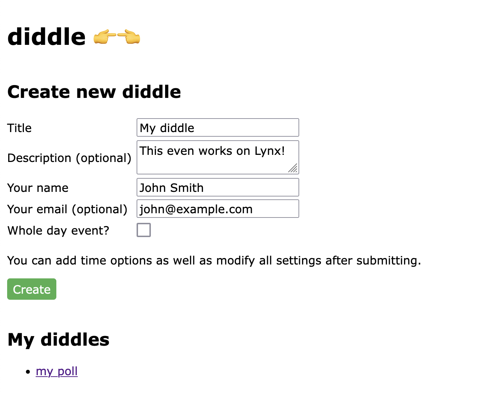
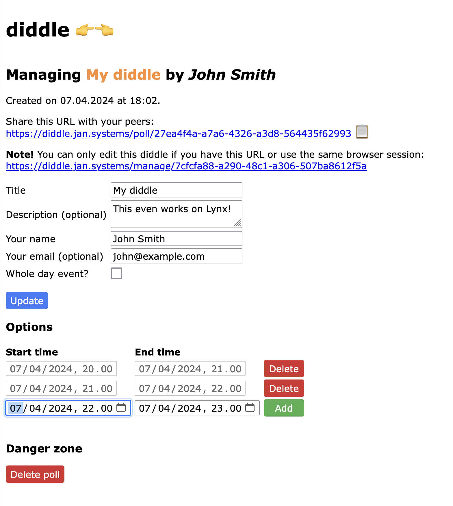
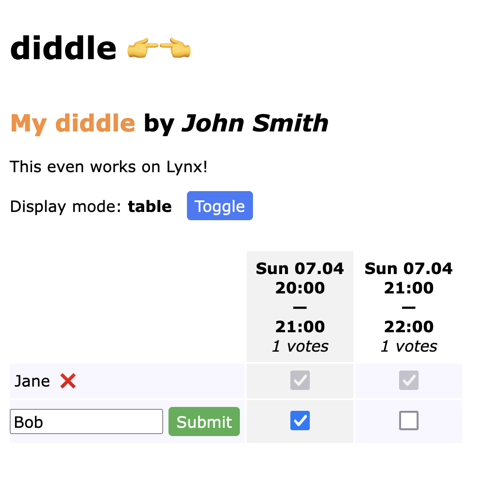
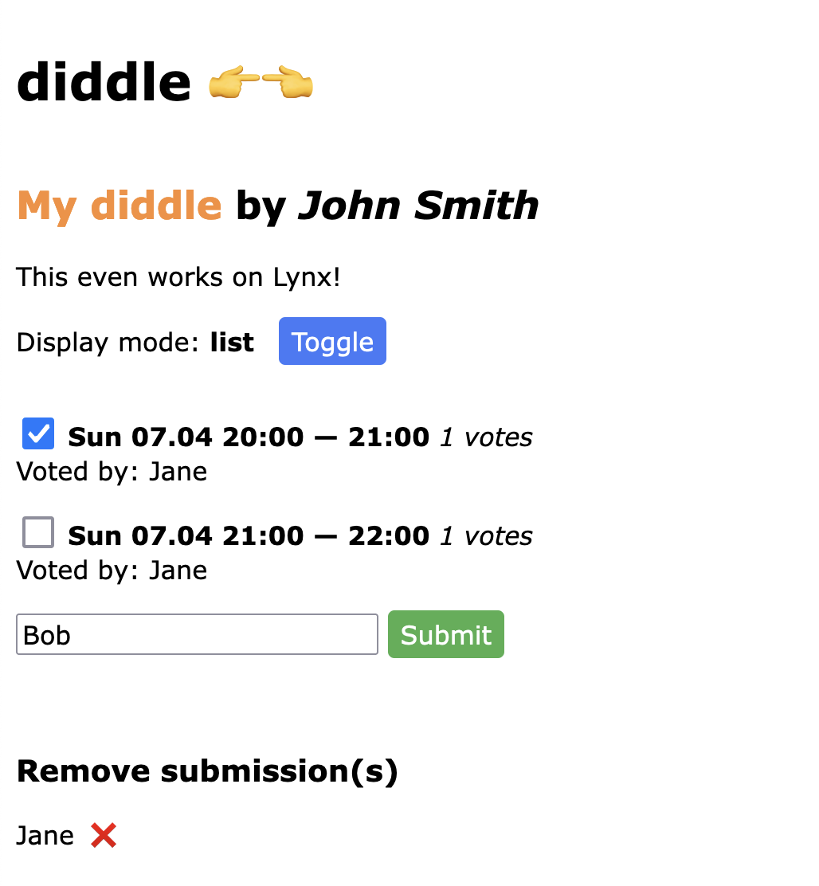

# diddle

Minimalist scheduling. A mobile friendly, fast, self-hosted Doodle alternative.

## Installation

The Diddle app is a traditional Flask web app that uses SQLite for persistence. User settings are stored in HTTP cookies.

Build a container image with `docker compose` (see `compose.yml`):

    docker compose build

or directly with `docker build`:

    docker build -t diddle:latest .

Deploy the image as you see fit.

You can also run the app without containerization:

    pip install -r requirements.txt # install pip dependencies
    touch .env                      # put your env vars here
    python apply_migrations.py      # prepare the database
    gunicorn --bind "0.0.0.0:8000" -w 4 app:app

## Environment variables

| Variable | Description |
| -------- | ----------- |
| BASE_URL | E.g. `diddle.my-server.net`, used as a prefix in dynamically generated links **(required)** |
| DB_PATH | Path to the SQLite database **(required)** |
| EMAIL_HOST | SMTP host address |
| EMAIL_PORT | SMTP port |
| EMAIL_HOST_USER | SMTP host user |
| EMAIL_HOST_PASSWORD | SMTP host password |
| EMAIL_USE_TLS | Use STARTTLS with SMTP? |
| EMAIL_HEADERS | Additional SMTP headers, format: `header1=foo,header2=bar` |
| EMAIL_MESSAGE_FROM | Email message from address |
| POLICY_URL | Address of the policy & terms page |
| POLICY_INSTANCE_DOMAIN | The domain part of the BASE_URL |
| POLICY_CONTACT_EMAIL | Your contact email |

`EMAIL_` variables are only required if at least one of them is defined.

`POLICY_` variables are used for the Privacy policy & Terms of use page. See relevant section below.

## Screenshots

### Front page

### Manage poll page

### Vote page (table mode)

### Vote page (list mode)

## Development

Run Flask in dev mode:

    flask --app app --debug run -p 8000

## Privacy policy and Terms of use page

By defining a privacy and terms address in `POLICY_URL`, a link to it is rendered in the front page footer. You may set the value to `/policy` and create a `templates/policy.html.j2` file to serve a policy page as part of the app. The repository contains a sample policy template in `templates/policy_sample.html.j2` that uses the environment variables `POLICY_INSTANCE_DOMAIN` and `POLICY_CONTACT_EMAIL`. You may copy that sample to `templates/policy.html.j2` and make necessary changes to reflect the reality of your hosted environment.

The developers of `diddle` take no responsibility about the content and legality of any policy you display to your users, whether it's based on the sample policy or not.
